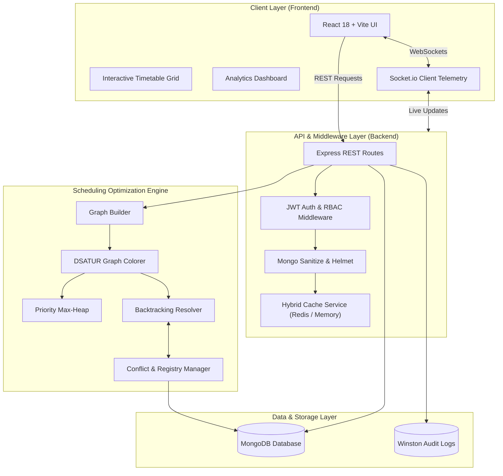

<div align="center">

  <h1>🎓 Smart Academic Scheduler</h1>
  <h3><i>Graph-Based Automated Timetable Optimization & Analytics Platform</i></h3>

  <p>
    An intelligent, constraint-driven academic schedule generation system built on <b>Graph Coloring Algorithms (DSATUR & Backtracking)</b>, real-time WebSocket telemetry, hybrid caching, and comprehensive analytics.
  </p>

  <p>
    <a href="#-key-features"><strong>Explore Features »</strong></a> &nbsp;|&nbsp;
    <a href="#-system-architecture--algorithm-flow"><strong>System Architecture »</strong></a> &nbsp;|&nbsp;
    <a href="#-getting-started"><strong>Quick Start »</strong></a> &nbsp;|&nbsp;
    <a href="#-api-reference-overview"><strong>API Docs »</strong></a>
  </p>

  <p>
    
    
    
    
    
    
    
    
  </p>

  <br />
</div>

---

## 📌 Executive Summary

Academic timetabling in educational institutions is a classic **NP-hard combinatorial optimization problem**. Managing hundreds of courses, faculty availabilities, room capacities, lab equipment constraints, and student batch overlaps manually is prone to human error, room double-bookings, and faculty fatigue.

**Smart Academic Scheduler** solves this by modeling academic schedules as **Constraint Satisfaction Graphs**. Utilizing **DSATUR (Degree of Saturation)** dynamic chromatic vertex ordering paired with **Backtracking with Heuristics**, the engine constructs conflict-free, faculty-balanced, and highly optimized timetables in seconds.

---

## ✨ Key Features

<table>
  <tr>
    <td width="50%">
      <h3>🧩 Graph-Coloring Engine</h3>
      <ul>
        <li><b>DSATUR Algorithm:</b> Dynamically selects vertices with maximum saturation degree to color hardest constraints first.</li>
        <li><b>Priority Heap & Backtracking:</b> Resolves complex slot bottlenecks with optimized backtracking heuristics.</li>
        <li><b>Zero Hard Conflicts:</b> Guarantees no teacher, batch, room, or lab double-bookings.</li>
      </ul>
    </td>
    <td width="50%">
      <h3>⚡ Real-Time Telemetry</h3>
      <ul>
        <li><b>Socket.IO Integration:</b> Live streaming of timetable generation progress and status updates.</li>
        <li><b>Interactive Feedback:</b> Visual indicator cards for real-time conflict detection and status monitoring.</li>
        <li><b>Instant Refresh:</b> Automated UI updates upon schedule generation completion.</li>
      </ul>
    </td>
  </tr>
  <tr>
    <td width="50%">
      <h3>📊 Resource Analytics</h3>
      <ul>
        <li><b>Faculty Workload Index:</b> Tracks daily and weekly teaching load distribution.</li>
        <li><b>Room Utilization Efficiency:</b> Measures occupancy rates across classrooms and labs.</li>
        <li><b>Schedule Health Score:</b> Evaluates overall constraint satisfaction and slot distribution quality.</li>
      </ul>
    </td>
    <td width="50%">
      <h3>🛡️ Security & Audit Logging</h3>
      <ul>
        <li><b>JWT Authentication & RBAC:</b> Secure role-based access control (Super Admin, Admin, Faculty, Student).</li>
        <li><b>Audit Trail:</b> Tracks all system mutations (create, update, delete, schedule generation) with IP & user tags.</li>
        <li><b>Input Sanitization & Security:</b> Rate limiting, Helmet security headers, and Mongo sanitize defense.</li>
      </ul>
    </td>
  </tr>
  <tr>
    <td width="50%">
      <h3>💾 Hybrid Caching Layer</h3>
      <ul>
        <li><b>Redis Acceleration:</b> Caches frequent analytics, configuration, and timetable views.</li>
        <li><b>Smart In-Memory Fallback:</b> Gracefully falls back to high-speed local memory cache if Redis is unavailable.</li>
        <li><b>Automated Invalidation:</b> Cache invalidated on schedule modifications or entity updates.</li>
      </ul>
    </td>
    <td width="50%">
      <h3>📁 Data Import & Multi-Format Export</h3>
      <ul>
        <li><b>Bulk CSV Import:</b> Batch upload classrooms, departments, faculty, and subject rosters.</li>
        <li><b>PDF Export:</b> Publication-ready printable grid layouts powered by <code>PDFKit</code>.</li>
        <li><b>CSV Export:</b> Multi-table raw data exports for institutional records.</li>
      </ul>
    </td>
  </tr>
</table>

---

## 🏗️ System Architecture & Algorithm Flow



---

## 💻 Tech Stack

| Domain | Technologies Used |
| :--- | :--- |
| **Frontend** | React 18, Vite 5, Tailwind CSS 3, React Router v6, Axios, Socket.io-client |
| **Backend** | Node.js (>=18), Express 4, Mongoose 8, Socket.io 4, Winston, Helmet, Rate Limit |
| **Algorithms** | DSATUR Graph Coloring, Chromatic Saturation Degree, Priority Max-Heap, Backtracking |
| **Database & Cache** | MongoDB (Mongoose ORM), Redis (ioredis with in-memory fallback) |
| **Export & Import** | PDFKit (PDF generation), ExcelJS / csv-parser / json2csv (CSV data pipeline) |
| **Code Quality** | ESLint (Airbnb base), Prettier, Nodemon |

---

## 🚀 Getting Started

Follow these steps to set up and run the project on your local environment.

### Prerequisites

- **Node.js**: `v18.0.0` or higher
- **npm**: `v9.0.0` or higher
- **MongoDB**: Local MongoDB instance (`mongodb://localhost:27017`) or MongoDB Atlas URI
- **Redis** *(Optional)*: Local Redis instance on port `6379` (System automatically falls back to in-memory caching if Redis is offline)

---

### 1️⃣ Clone the Repository

```bash
git clone https://github.com/yogi941/smartScheduler.git
cd smartScheduler
```

---

### 2️⃣ Backend Setup & Execution

Navigate to the backend directory, install dependencies, configure environment variables, and seed demo data:

```bash
# Navigate to backend
cd smart-academic-scheduler-backend

# Install dependencies
npm install

# Create environment configuration file (.env)
cp .env.example .env
```

#### Environment Variables (`.env`)
Ensure your `.env` contains the following configuration:
```env
PORT=5000
NODE_ENV=development
MONGODB_URI=mongodb://127.0.0.1:27017/smart_academic_scheduler
JWT_SECRET=your_super_secret_jwt_key_change_in_production
JWT_EXPIRE=24h
REDIS_HOST=127.0.0.1
REDIS_PORT=6379
REDIS_PASSWORD=
CORS_ORIGIN=http://localhost:5173
LOG_LEVEL=info
```

#### Seed Initial Data & Super Admin
```bash
# Seed Super Admin User (admin@scheduler.com / Admin@123)
node scripts/seedSuperAdmin.js

# Seed Demo Academic Data (Departments, Faculty, Subjects, Rooms, Batches)
node scripts/seedDemoData.js

# Start Backend Server in Development Mode
npm run dev
```
*Backend server will start on `http://localhost:5000`.*

---

### 3️⃣ Frontend Setup & Execution

Open a new terminal window, navigate to the frontend directory, install dependencies, and launch Vite dev server:

```bash
# Navigate to frontend
cd smart-academic-scheduler-frontend

# Install dependencies
npm install

# Start Vite Development Server
npm run dev
```
*Frontend application will open on `http://localhost:5173`.*

---

## 🔌 API Reference Overview

The backend exposes a modular RESTful API structured under `/api/v1/`:

<details>
<summary><b>🔑 Auth & Users API (Click to expand)</b></summary>

| Method | Endpoint | Description | Access |
| :--- | :--- | :--- | :--- |
| `POST` | `/api/v1/auth/login` | Authenticate user & issue JWT token | Public |
| `GET` | `/api/v1/auth/me` | Retrieve authenticated user profile | Private |
| `GET` | `/api/v1/users` | List all users | Super Admin, Admin |
| `POST` | `/api/v1/users` | Create new user account | Super Admin |
</details>

<details>
<summary><b>📅 Timetables & Scheduling API (Click to expand)</b></summary>

| Method | Endpoint | Description | Access |
| :--- | :--- | :--- | :--- |
| `POST` | `/api/v1/timetables/generate` | Trigger graph-based automated timetable generation | Admin, Super Admin |
| `GET` | `/api/v1/timetables` | Fetch generated timetables | Authenticated Users |
| `GET` | `/api/v1/timetables/:id` | Get detailed timetable by ID | Authenticated Users |
| `GET` | `/api/v1/timetables/:id/export/pdf` | Export timetable to printable PDF | Authenticated Users |
| `GET` | `/api/v1/timetables/:id/export/csv` | Export timetable grid to CSV | Authenticated Users |
</details>

<details>
<summary><b>📊 Analytics & Audit Logs API (Click to expand)</b></summary>

| Method | Endpoint | Description | Access |
| :--- | :--- | :--- | :--- |
| `GET` | `/api/v1/analytics/overview` | Fetch system resource utilization & metrics | Admin, Super Admin |
| `GET` | `/api/v1/audit-logs` | Fetch system mutation history & event logs | Super Admin |
</details>

<details>
<summary><b>📥 Bulk Data Import API (Click to expand)</b></summary>

| Method | Endpoint | Description | Access |
| :--- | :--- | :--- | :--- |
| `POST` | `/api/v1/import/csv` | Upload CSV data for batch creation of entities | Admin, Super Admin |
</details>

---

## 🛠️ Project Directory Structure

```
smartScheduler/
├── smart-academic-scheduler-backend/
│   ├── scripts/                  # Seed scripts for initial setup
│   └── src/
│       ├── config/               # Database, Redis & Socket configurations
│       ├── constants/            # Global app constants
│       ├── controllers/          # Request handlers
│       ├── database/             # DB connection logic
│       ├── export/               # PDF & CSV generation engine
│       ├── middlewares/          # Security, Auth & Error handlers
│       ├── models/               # Mongoose schemas & data models
│       ├── repositories/         # Data access repository layer
│       ├── routes/               # Modular REST route definitions
│       ├── scheduling-engine/    # 🧠 DSATUR Graph Coloring Engine & Algorithms
│       │   ├── algorithms/       # DSATUR, Greedy, Backtracking algorithms
│       │   ├── builders/         # Graph construction builders
│       │   ├── dataStructures/   # Custom MaxHeap & Graph structures
│       │   └── graph/            # Graph representation classes
│       ├── services/             # Business logic & caching services
│       ├── utils/                # Helper utilities & loggers
│       └── validators/           # Express validator schemas
│
├── smart-academic-scheduler-frontend/
│   └── src/
│       ├── api/                  # Axios HTTP client configuration
│       ├── components/           # Reusable UI components & modals
│       ├── context/              # React Context (Auth, Theme)
│       ├── hooks/                # Custom hooks (Socket.io, State)
│       ├── layouts/              # Sidebar & Header Navigation layouts
│       ├── pages/                # Application pages & Dashboards
│       │   └── dashboard/        # Analytics, Timetables, Users, Logs
│       └── routes/               # React Router configurations
│
└── README.md                     # Documentation
```

---

## 🤝 Contributing

Contributions, issues, and feature requests are welcome!  
Feel free to check the [issues page](https://github.com/yogi941/smartScheduler/issues).

1. **Fork** the Repository
2. Create your Feature Branch (`git checkout -b feature/AwesomeFeature`)
3. **Commit** your Changes (`git commit -m 'Add some AwesomeFeature'`)
4. **Push** to the Branch (`git push origin feature/AwesomeFeature`)
5. Open a **Pull Request**

---

## 📜 License

This project is licensed under the [MIT License](LICENSE).

---

<div align="center">
  <p>Crafted with ❤️ for Higher Education Institutions & Academic Communities</p>
  <p><strong>© 2026 Smart Academic Scheduler Team</strong></p>
</div>

